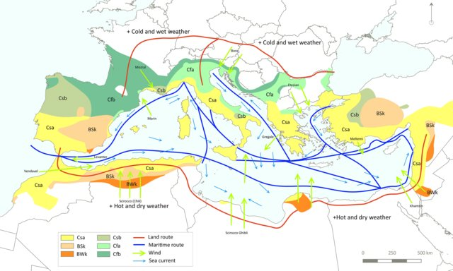

# meteo_data
 This application is designed to collect, process, and store meteorological data for specified locations. It's primarily written in Python and uses MongoDB Atlas as its database. The main objective is to prepare and organize data so that it can be easily accessed and utilized by various APIs.

## Units and measurements

### Sample info:

* `location_id`: (**int**) with unique location ID, so we don't have to use the document ID.

* `location_name`: (**string**) with the name of the place being sampled.

* `fetched_spanish_time`: (**string**) with daylight savings corrected time YYYY-MM-DD HH:MM:SS:MSMSMS+GMTOFFSET.

* `fetched_unix_time`: (**int**) with unix time indicating the time when that data was fetched.

* `sample_time`: (**string**) indicating the time of day that sample describes.

* `is_day`: (**boolean**) indicating if that sample was taken during the day or at night

### Sea info:

* `wave_direction`: (**int**) (0-359) indicating the direction of the waves (0 is north).

* `wind_wave_direction`: (**int**) (0-359) indicating the direction of the waves caused by the wind (0 is north).

* `swell_wave_direction`: (**int**) (0-359) indicating the direction of the swell waves (0 is north).

* `ocean_current_direction`: (**int**) (0-359) indicating the direction of the ocean currents in that location (0 is north). This measurement is taken from a location close by, that has ocean currents information.

* `ocean_current_velocity`: (**float**) (m/s) indicating the speed of the ocean currents in that location. This measurement is taken from a location close by, that has ocean currents information.

### Weather info:

* `daily_data`: object containing data that summerizes a daily data po(**int**).

    * `sunrise`: (**string**) time of sunrise (2024-08-09T06:53)

    * `sunset`: (**string**) time of sunset (2024-08-09T06:53)

    * `sunlight`: (**float**) indicating how long the sun shined today. Cloudy counts as not shining i think.

    * `precipitation_total`: (**int**) Sum of all the precipitation types on this day.

    * `wind_main_direction`: (**int**) (0-359) Dominant wind direction for this day.

* `air_temperature`: (**float**) (ºC) indicating the air temperature.

* `air_humidity`: (**int**) (%) indicating the air humidity.

* `cloud_cover`: (**int**) (%) indicating the cloud cover at that location.

* `wind_speed`: (**float**) (m/s) indicating the wind speed at the ground for that location.

* `uv_index`: (**float**) (0-10) indicating the UV index for each hour

## Data submitted to database

In each document that the app submits to MongoDB, we'll have all the elements listed above. The hourly variables will be in 1h increments.

`MongoDB document`:
  
>{\
    &nbsp;&nbsp;&nbsp;&nbsp;_id: 66b5f23f850e73a884359fa1\
    &nbsp;&nbsp;&nbsp;&nbsp;location_id: 1000000\
    &nbsp;&nbsp;&nbsp;&nbsp;location_name: "Cala Estreta"\
    &nbsp;&nbsp;&nbsp;&nbsp;fetched_spanish_time: "2024-08-09T12:41:02.118085+02:00"\
    &nbsp;&nbsp;&nbsp;&nbsp;fetched_unix_time: 1723200063\
    \
    &nbsp;&nbsp;&nbsp;&nbsp;daily_data: {\
    &nbsp;&nbsp;&nbsp;&nbsp;&nbsp;&nbsp;&nbsp;&nbsp;sunrise: "2024-08-05T06:49"\
    &nbsp;&nbsp;&nbsp;&nbsp;&nbsp;&nbsp;&nbsp;&nbsp;sunset: "2024-08-05T20:55"\
    &nbsp;&nbsp;&nbsp;&nbsp;&nbsp;&nbsp;&nbsp;&nbsp;sunlight: 45780.7\
    &nbsp;&nbsp;&nbsp;&nbsp;&nbsp;&nbsp;&nbsp;&nbsp;precipitation_total: 0\
    &nbsp;&nbsp;&nbsp;&nbsp;&nbsp;&nbsp;&nbsp;&nbsp;wind_main_direction: 140\
    &nbsp;&nbsp;&nbsp;&nbsp;}\
    \
    &nbsp;&nbsp;&nbsp;&nbsp;T_0: {\
    &nbsp;&nbsp;&nbsp;&nbsp;&nbsp;&nbsp;&nbsp;&nbsp;sample_time: "2024-08-10T00:00"\
    &nbsp;&nbsp;&nbsp;&nbsp;&nbsp;&nbsp;&nbsp;&nbsp;wave_direction: 68\
    &nbsp;&nbsp;&nbsp;&nbsp;&nbsp;&nbsp;&nbsp;&nbsp;wind_wave_direction: 180\
    &nbsp;&nbsp;&nbsp;&nbsp;&nbsp;&nbsp;&nbsp;&nbsp;swell_wave_direction: 68\
    &nbsp;&nbsp;&nbsp;&nbsp;&nbsp;&nbsp;&nbsp;&nbsp;ocean_current_direction: 0\
    &nbsp;&nbsp;&nbsp;&nbsp;&nbsp;&nbsp;&nbsp;&nbsp;ocean_current_velocity: 0.05\
    &nbsp;&nbsp;&nbsp;&nbsp;&nbsp;&nbsp;&nbsp;&nbsp;air_temperature: 26.1\
    &nbsp;&nbsp;&nbsp;&nbsp;&nbsp;&nbsp;&nbsp;&nbsp;air_humidity: 75\
    &nbsp;&nbsp;&nbsp;&nbsp;&nbsp;&nbsp;&nbsp;&nbsp;cloud_cover: 0\
    &nbsp;&nbsp;&nbsp;&nbsp;&nbsp;&nbsp;&nbsp;&nbsp;wind_speed: 1.5\
    &nbsp;&nbsp;&nbsp;&nbsp;&nbsp;&nbsp;&nbsp;&nbsp;uv_index: 0\
    &nbsp;&nbsp;&nbsp;&nbsp;&nbsp;&nbsp;&nbsp;&nbsp;is_day: false\
    &nbsp;&nbsp;&nbsp;&nbsp;}\
}
